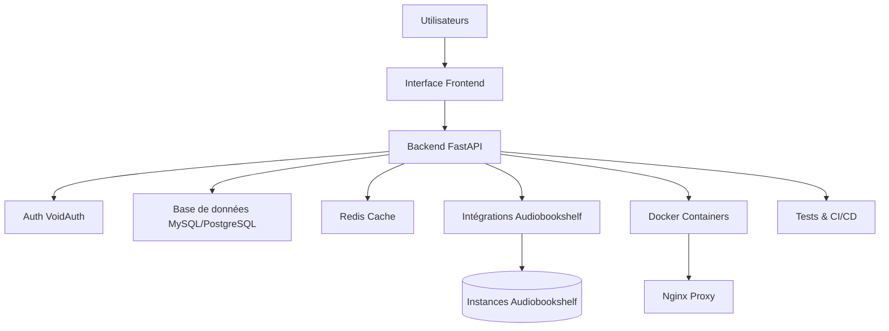

# ROADMAP AudioNexus

## Vue d'ensemble du projet
AudioNexus est une plateforme de gestion centralisée pour les bibliothèques de livres audio, s'intégrant avec des instances Audiobookshelf externes. La version actuelle 0.6.0 consolide les fondamentaux avec authentification VoidAuth, backend FastAPI et conteneurisation Docker optimisée.

## Architecture système

## Organisation des tâches
### LÉGENDE :
- 🔴 **Urgent** : Bloqueurs critiques pour la stabilité/ sécurité - Priorité absolue
- 🟡 **Moyenne** : Améliorations nécessaires pour production - Priorité haute
- 🟢 **Long terme** : Fonctionnalités additionnelles - Priorité moyenne

## PHASE 1: STABILITÉ ET ERREURS CRITIQUES (Urgent - 1-2 semaines)
### RÉSOLUTION DES ERREURS FATALES (🔴 TÉLÉPHONE ROUGE)
- [x] **Résoudre erreurs 422 FastAPI dans dépendances DB** (TERMINÉ ✅)
  - Déboguer paramètres de requête invalides
  - Corriger gestion des dépendances FastAPI pour connexions DB
- [x] **Unifier système get_db() synchrone/asynchrone** (TERMINÉ ✅)
  - Éliminer conflits entre implémentations multiples
  - Résoudre imports circulaires et dépendances
- [x] **Stabiliser authentification VoidAuth** (TERMINÉ ✅)
  - Supprimer erreurs 500/422 restantes dans endpoints auth
  - Valider flux inscription/connexion complets
- [x] **Résoudre conflit MySQL/SQLite** (TERMINÉ ✅)
  - Implémenter pattern Strategy pour basculement DB
  - Migration sécurisée vers MySQL en production

## PHASE 2: SÉCURITÉ ENTERPRISE (Après Phase 1 - 2-3 semaines)
### PROTECTIONS CRITIQUES (🔴)
- [x] **Implémenter protections CSRF + headers de sécurité** (TERMINÉ ✅)
  - Protection CSRF complète sur endpoints sensibles
  - Headers CSP, HSTS, XSS, Secure Cookies
- [ ] **Rate limiting + protection anti-DoS**
  - Limiteur intelligent par IP/endpoint
  - Détection attaques DoS, Monitoring métriques
- [x] **Chiffrement AES-256 + audit trail** (TERMINÉ ✅)
  - Chiffrement données sensibles (mot de passe, tokens)
  - Logs détaillés opérations sécurisées pour conformité

## PHASE 3: OPTIMISATIONS PRODUCTION (Après Phase 2 - 2 semaines)
### MISES À JOUR TECHNIQUES (🟡)
- [x] **Migration VoidAuth v4.x** (TERMINÉ ✅)
  - Compatibilité APIs sécurité VoidAuth 4.x
  - Migration endpoints existants
- [x] **Complétion intégration Audiobookshelf** (TERMINÉ ✅)
  - Gestion sécurisée tokens API multi-instances
  - Synchronisation métadonnées intelligente
  - Résolution conflits de données
- [x] **Documentation complète + guides mis à jour** (TERMINÉ ✅)
  - Documentation technique exhaustive
  - Guides installation/déploiement à jour
  - Exemples d'utilisation pour développeurs
- [x] **Scripts déploiement industrialisé** (TERMINÉ ✅)
  - Builds Docker multi-stage optimisés
  - Déploiement zero-downtime avec load balancing
  - Rollbacks automatiques en cas d'échec

## PHASE 4: FRONTEND ET TESTS (Après Phase 3 - 4 semaines)
### REFONTE INTERFACE UTILISATEUR (🟡)
- [ ] **Révision technologique frontend**
  - Déterminer pile technique définitive (React actuelle vs migration Svelte)
  - Évaluation coûts/bénéfices pour équipe développement
- [ ] **Interface utilisateur complétion**
  - Tableau de bord avancé avec métriques
  - Gestion bibliothèques et synchronisation
  - Lecteur audio intégré responsive
  - Thème sombre/clair, accessibilité WCAG

### TESTS ET QUALITÉ (🟡)
- [ ] **Tests d'intégration complets**
  - Tests end-to-end Critical Paths
  - Tests de performance charge élevée
  - Tests de régression automatisés
- [ ] **Mise en place CI/CD**
  - Pipelines GitHub Actions
  - Déploiement automatisé staging/production
  - Monitoring et alerting basée sur métriques

## PHASE 5: NOUVELLES FONCTIONNALITÉS (Long terme - 8 semaines+)
### MULTI-INSTANCES ET AVANCÉ (🟢)
- [ ] **Gestion multi-instances Audiobookshelf**
  - Interface administration instances distantes
  - Répartition de charge automatique
  - Monitoring santé instances
- [ ] **Fonctionnalités utilisateur avancées**
  - Synchronisation utilisateurs/bi-directionnelle
  - Profils personnalisables avec préférences
  - Historique d'audition cross-instance

### AUTOMATISATION ET IA (🟢)
- [ ] **Traitement fichiers avancé**
  - Conversion automatique M4B (FFmpeg)
  - Extraction métadonnées améliorée
  - Analyse antivirus intégrée
- [ ] **Synthèse vocale et génération**
  - Génération livres audio depuis EPUB
  - Support synthèse vocale intégrée
  - Optimisations performance cluster

## MÉTRIQUES DE SUCCÈS PHASE PAR PHASE
### Phase 1 (Stabilité) - TERMINÉE
- ✅ Erreurs 422 résolues (0 erreurs restantes)
- ✅ Authentification stable (12/12 tests passent)
- ✅ Base de données unifiée (pas de conflits)

### Phase 2 (Sécurité) - TERMINÉE
- ✅ Audit sécurité passé (OWASP TOP 10)
- ✅ Rate limiting efficace (tests charge)
- ✅ Conformité GDPR/RGPD

### Phase 3 (Production) - TERMINÉE
- ✅ Déploiements zero-downtime
- ✅ Documentation complète utilisateur
- ✅ Équipes opérationnelles autonomes

### Phase 4 (Frontend)
- ✅ Interface utilisateur complète et responsive
- ✅ UX validée utilisateurs pilotes
- ✅ Performances optimisées (<2s loading)

### Phase 5 (Évolution)
- ✅ Support 10+ instances Audiobookshelf
- ✅ 99.9% uptime production
- ✅ Communauté contributeurs actifs

## RISQUES ET DÉPENDANCES
### RISQUES TECHNIQUES (🔴)
- Migration VoidAuth 4.x : Risque compatibilité, nécessite tests bêta
- Erreurs 422 persistantes : Impact développeur bloquant
- Conflit DB MySQL/SQLite : Impact tests/production instable

### RISQUES PROJET (🟡)
- Équipe réduite : Risque surcharge développement
- Documentation incomplète : Risque adoption utilisateur lente
- Changements API externes : Risque breaking changes Audiobookshelf

### POSSIBLE QUESTIONS UTILISATEUR
Est-il nécessaire de contacter le support VoidAuth pour v4.x ?
L'équipe est-elle capable de supporter migration Svelte sans retard ?
Quelle est la priorité réelle sur fonctionnalités avancées vs stabilité ?

---
**Documents connexes** : [CHANGLOG.md](CHANGELOG.md) | [ETAT_DU_PROJET.md](documentation/ETAT_DU_PROJET.md) | [TODO.md](TODO.md)