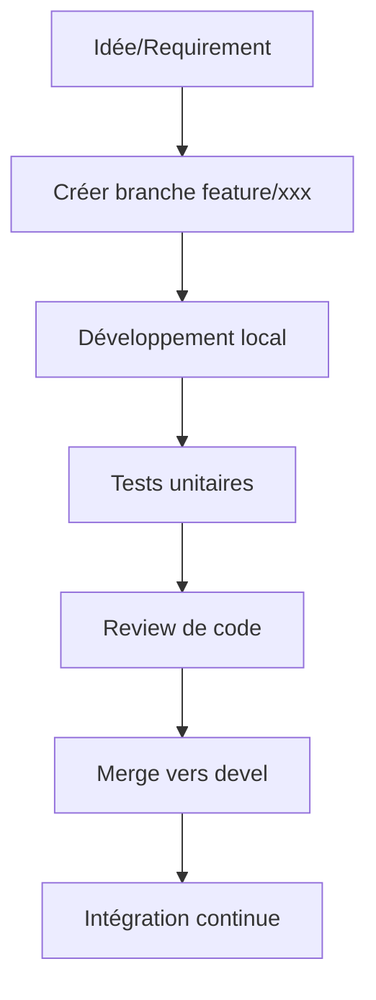
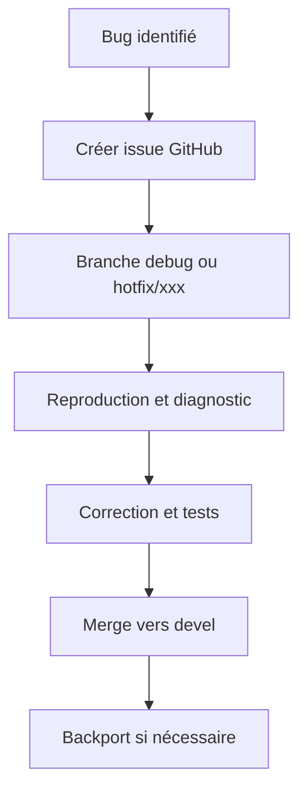
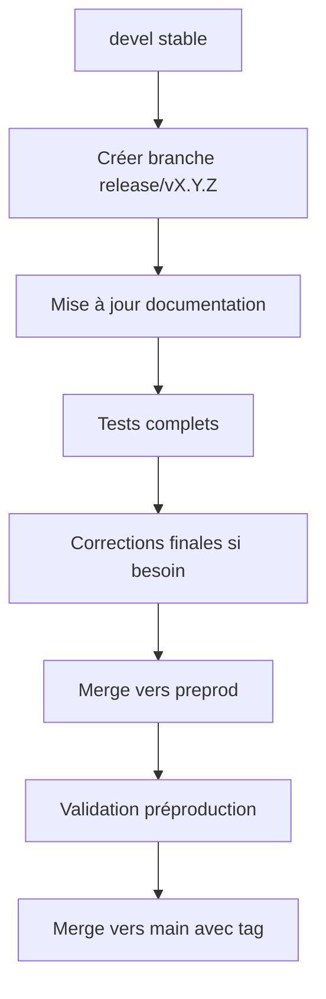

# 🔄 WORKFLOWS.md - Protocoles et Workflows AudioNexus

Ce document décrit les workflows et protocoles établis pour le développement et la maintenance d'AudioNexus.

---

## 🎯 Workflow de Développement Standard

### 1. Création de Fonctionnalités



**Commandes typiques:**
```bash
# Création de branche
git checkout -b feature/nouvelle-fonctionnalite devel

# Développement et commits
git add .
git commit -m "feat: ajouter nouvelle fonctionnalite"

# Push et PR
git push origin feature/nouvelle-fonctionnalite
# Créer PR vers devel sur GitHub
```

### 2. Correction de Bugs



**Protocole debug:**
```bash
# Basculer sur debug
git checkout debug
git pull origin debug

# Appliquer corrections
git add .
git commit -m "fix: corriger [description du bug]"

# Merge vers devel
git checkout devel
git merge debug
```

---

## 🔧 Workflow de Debug

### 1. Session de Debug Typique

**Étapes:**
1. Identifier le problème (logs, erreurs, comportement inattendu)
2. Isoler le composant/procédure concerné
3. Créer des tests de reproduction
4. Appliquer les corrections minimales
5. Valider avec les tests existants
6. Documenter la solution

**Exemple avec FFmpeg:**
```bash
# Diagnostic
docker logs audionexus-backend -f

# Test de reproduction
python -m pytest tests/test_services/test_upload_thread_fix.py -v

# Correction
# Modifier app/services/upload_service.py

# Validation
docker-compose restart backend
docker logs audionexus-backend -f
```

### 2. Gestion des Warnings MySQL

**Problème:** Messages de dépréciation MySQL
**Solution appliquée:**
```yaml
# Dans tous les docker-compose.yml
command: --default-authentication-plugin=mysql_native_password --host-cache-size=0
```

---

## 📦 Workflow de Release

### 1. Préparation de Release



**Checklist pré-release:**
- [ ] Tous les tests passent
- [ ] Documentation à jour (README, CHANGELOG, TODO)
- [ ] Migration de base de données testée
- [ ] Variables d'environnement documentées
- [ ] Images Docker buildées et testées

### 2. Processus de Tagging

```bash
# Sur la branche main
git checkout main
git pull origin main

# Créer tag
git tag -a v0.12.18 -m "Release v0.12.18"
git push origin v0.12.18

# Build et push des images
docker-compose build
docker push votre-registry/audionexus:latest
docker push votre-registry/audionexus:v0.12.18
```

---

## 🔄 Workflow CI/CD

### 1. Pipeline GitHub Actions

**Fichier:** `.github/workflows/docker-build-test.yml`

**Étapes:**
1. Checkout du code
2. Setup Python et Node.js
3. Installation des dépendances
4. Build des images Docker
5. Tests unitaires
6. Push des images (sur demande)

**Déclencheurs:**
- Push sur `devel`, `debug`, `preprod`, `main`
- Pull Requests vers ces branches
- Tags de version

### 2. Stratégie de Build

**Optimisations:**
- Cache Docker pour accélérer les builds
- Multi-stage builds pour réduire la taille des images
- Build séparés pour frontend et backend
- Tests exécutés avant le push des images

---

## 📝 Workflow de Documentation

### 1. Mise à Jour de la Documentation

**Fréquence:** À chaque changement significatif

**Fichiers à maintenir:**
- `README.md`: État général et instructions
- `TODO.md`: Tâches en cours et priorisation
- `ROADMAP.md`: Feuille de route stratégique
- `MEMORY.md`: Mémoire technique
- `WORKFLOWS.md`: Protocoles et workflows
- `documentation/`: Documentation technique détaillée

### 2. Structure de la Documentation

```
documentation/
├── CHANGELOG.md        # Historique des changements
├── ARCHITECTURE.md      # Architecture technique
├── API_DOCS.md         # Documentation API
├── DEPLOYMENT.md       # Guide de déploiement
├── DEVELOPMENT.md      # Guide de développement
└── SYNTHESE_*.md       # Synthèses d'avancement
```

---

## 🔒 Workflow de Sécurité

### 1. Gestion des Secrets

**Bonnes pratiques:**
- Jamais de secrets dans le code ou les fichiers de config
- Utilisation des variables d'environnement
- GitHub Secrets pour le CI/CD
- Rotation régulière des clés API

**Fichiers sensibles:**
```
.env                # Fichier d'environnement local
.env.production     # Configuration production
.env.test           # Configuration tests
```

### 2. Audit de Sécurité

**Points à vérifier régulièrement:**
- Dépendances obsolètes (`npm audit`, `pip list --outdated`)
- Vulnérabilités connues (Snyk, Dependabot)
- Permissions des volumes Docker
- Configuration CORS
- Rate limiting API

---

## 🛠 Workflow de Maintenance

### 1. Mise à Jour des Dépendances

```bash
# Backend
pip list --outdated
pip install --upgrade package_name

# Frontend
npm outdated
npm update package_name

# Mise à jour des requirements
pip freeze > requirements.txt
```

### 2. Nettoyage et Optimisation

**Tâches régulières:**
- Nettoyage des images Docker inutilisées
- Optimisation des volumes de base de données
- Rotation des logs
- Vérification des health checks

---

## 🤝 Workflow de Collaboration

### 1. Revue de Code

**Critères:**
- Respect des conventions de codage
- Couverture des tests
- Documentation des changements
- Absence de régression
- Optimisation des performances

### 2. Communication

**Canaux:**
- Issues GitHub pour les bugs et features
- Pull Requests pour les reviews
- Commit messages clairs et descriptifs
- Documentation à jour

---

## 📊 Workflow de Suivi

### 1. Métriques Clés

**À surveiller:**
- Temps de build Docker
- Temps de démarrage des services
- Couverture de tests
- Taille des images
- Temps de réponse API
- Utilisation mémoire

### 2. Journalisation

**Niveaux:**
- DEBUG: Informations détaillées
- INFO: Événements normaux
- WARNING: Comportements inattendus
- ERROR: Erreurs gérées
- CRITICAL: Échecs critiques

---

*Dernière mise à jour: 19/04/2026*